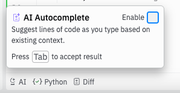

# Stick pile

🪵🪵🪵🪵 Welcome to your first game. Stick pile. 🪵🪵🪵🪵

## Rules of Stick pile :scroll:

* Stick pile is a head-to-head game played between two players. 
* The game starts with a pile of sticks. The number of starting sticks is chosen randomly at the start of each game (between 15 and 25).
* The aim of the game is to take the final stick from the pile 
* On each turn you can remove 1, 2 or 3 sticks from the pile. 
* Play continues until the final stick has been taken. The player who takes the final stick is the winner.
* For example, there are 5 sticks left on the pile. Player 1 takes 3 sticks, meaning there are 2 sticks left. Player 2 can now take the final two sticks and wins the game.

## Polite request 🙏
* ChatGPT or other large language models will immediately come up with a perfect solution to this game. Please refrain from using them!
* There is also information available online about optimal strategies to similar games to this. Please try to think of you strategy yourself.
* Please also close the AI assistant window in replit and disable AI autocomplete (bottom left of your screen).



## Your task 🔧

* Your task is to write code in Python to play this game.
* You only need to write code for your own player. The opponent's move is handled for you.
* You code will be written in a function called `choose_move` in your `main.py` file.
* (See `functions.md` if you are unclear about what functions are or how they work.)
* On each turn your `choose_move` will be called. This function should decide how many sticks to take from the pile.
* Your `choose_move` function has one input: `number_of_sticks_remaining`. Which is the number of sticks left on the pile. 
* Given this number you need to return how many sticks to remove.

## Invalid moves ❌

* If your player makes an invalid move, you will lose the game immediately.
* There are 4 types of invalid move.

1. You try to take more than 3 sticks (you function returns a number > 3).
2. Your function returns nothing.
3. You try to take more sticks than are remaining in the pile
4. Your function raises an error.


## Your main.py file

* There are only two things you should change in your main.py file:
* Your TEAM_NAME (do this first)
* Your choose_move function. Currently it raises a NotImplementedError. Delete this error and write your solution.

## Suggested Approach :+1:

* First try to make your solution that makes valid moves only and always grabs the last stick if possible.
* After you've got this, try to think of clever moves to make earlier in the game to beat your opponent.


### play_game
* At the bottom of the code you'll see a call to the function `play_game`
* You don't need to change this until you've got a good solution.

```python 
 play_game(
        your_choose_move=choose_move,
        opponent_choose_move=choose_move_randomly,
        game_speed_multiplier=1,
    )
```

* This is the code that runs the game with your solution.
* `opponent_choose_move` sets the opponent you will play against. Currently you are playing against an opponent that chooses a random number of valid sticks.
* If your soution is good enough to beat this everytime, you could think about choosing a harder opponent.
* `game_speed_multiplier` sets the speed that the game will run at. Change this if you want to see the moves faster or slower.


